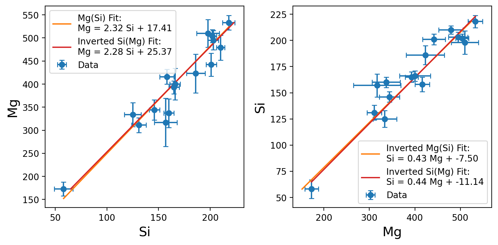
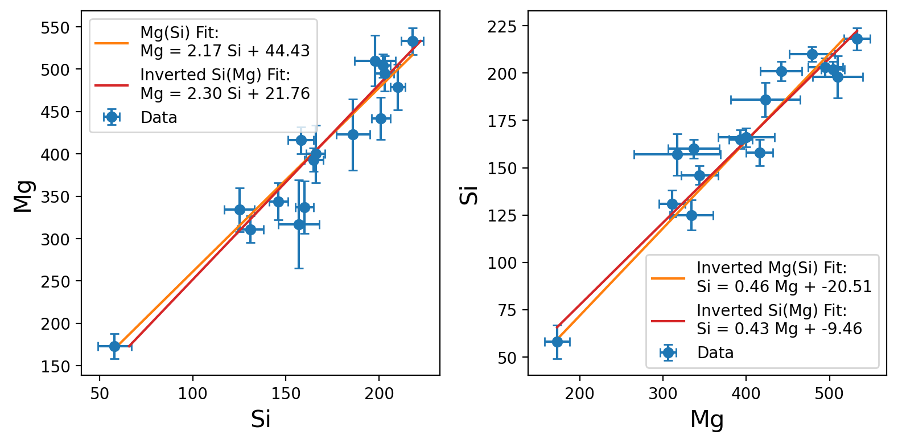

# Orthogonal Linear Regression: To Normalize or Not to Normalize `v_perp`

This notebook demonstrates the effect of **normalizing the perpendicular vector** (`v_perp`) when performing orthogonal linear regression with uncertainties in both x and y.

We compare two common approaches:

- ✅ **Unnormalized `v_perp = [m, -1]`** (as used by [Foreman-Mackey et al.](https://github.com/dfm))
- ⚠️ **Normalized `v_perp = [m, -1] / sqrt(1 + m²)`** (as suggested in [Hogg et al. 2010](https://arxiv.org/abs/1008.4686))

## 🔍 Objective

When fitting `y = m·x + b`, and then inverting the roles (fitting `x = m'·y + b'`), the gradients should be multiplicative inverses of each other: `m ≈ 1/m'`.

This property only holds if `v_perp` is **not normalized**. Normalizing `v_perp` breaks this reciprocal behavior and leads to biased slopes, as shown below.

---

## 🧪 Results

### Case 1: Using **Unnormalized** `v_perp` ✅

- The gradient of Mg vs Si is approximately the inverse of the Si vs Mg fit.
- This is the expected and desired behavior for symmetric orthogonal regression.

### Case 2: Using **Normalized** `v_perp` ⚠️

- The Mg vs Si and Si vs Mg fits are **not inverses**.
- This breaks the symmetry and suggests a flawed treatment of the geometry of uncertainties.

---

## 📦 Code Structure

- `fit_y_from_x`: Runs an MCMC fit using `emcee` for a given x/y dataset.
- `orthogonal_distance`: Computes the orthogonal distance to the line using a normalized or unnormalized perpendicular vector.
- `fit_and_plot`: Runs fits in both x/y and y/x directions and compares gradients.
- Visualizes the outcome in two subplots and prints reciprocal consistency.

---

## 🧠 Conclusion

This analysis clearly supports the use of **unnormalized** `v_perp` when performing orthogonal regression with uncertainties in both directions.

> ✅ Use `v_perp = [m, -1]`  
> 🚫 Avoid normalizing `v_perp`, or you lose the reciprocal gradient property.

---

## 🧵 Reference

- Hogg, Bovy, Lang (2010), *Data analysis recipes: Fitting a model to data*, [arXiv:1008.4686](https://arxiv.org/abs/1008.4686)
- Foreman-Mackey et al., [DataAnalysisRecipes](https://github.com/davidwhogg/DataAnalysisRecipes)

